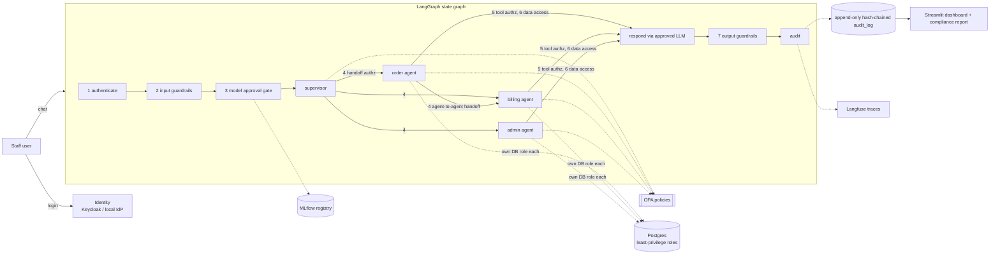

# GovSys: an end-to-end AI governance system (open source)

A multi-agent AI assistant (order, billing and admin specialists) in which **every request passes seven
enforced governance checks**. Each check covers one governance layer: identity, policy, data, model, runtime
and operations/compliance. Everything runs on open-source components, on-prem, and is sized for a
~50-person company.



## The seven runtime checks

| # | Check | Governance layer | Enforced by | Example of a blocked request |
|---|---|---|---|---|
| 1 | Human identity | Identity | Keycloak or local RS256 IdP; account status re-checked on every request | Suspended user with a still-valid token |
| 2 | Input guardrails | Runtime | Guardrails AI (local validators, telemetry off) | Prompt injection, SQL injection |
| 3 | Model approval gate | Model | MLflow Model Registry tags + `production` alias | Rejected `gemma3:270m` requested |
| 4 | Agent identity and handoff | Identity + policy | SPIFFE-ID workload tokens (`act` claim) + OPA | Forged agent token; finance user using the admin agent |
| 5 | Tool-call authorization | Policy | OPA on every tool call, with arguments | Intern cancels an order; refund over $200 without finance_manager |
| 6 | Data access | Data | One Postgres role per agent (column-level grants) + catalog-driven PII masking | Compromised agent selecting `national_id` |
| 7 | Output guardrails | Runtime | Guardrails AI | National ID, secrets or unmasked PII in an answer |
| + | Audit | Operations / compliance | INSERT-only role, SHA-256 hash chain, append-only trigger, JSONL, Langfuse | Any UPDATE or DELETE on the audit log |

Every control **fails closed**: if OPA or the model registry is unreachable, the request is denied.

## Quick start (Windows, no Docker)

Prerequisites: Python 3.13, and [Ollama](https://ollama.com) with `phi3` (and optionally `gemma3:270m` for the gate demo).

```powershell
.\setup.ps1     # venv, deps, portable Postgres 17 + OPA binaries, DB/roles/seed, IdP, MLflow registry
.\start.ps1     # Postgres :5433, OPA :8181, MLflow UI :5000, dashboard http://localhost:8501
.\stop.ps1
```

Demo accounts (local IdP):

| User | Password | Roles | What they can do |
|---|---|---|---|
| alice | Alice@123 | support | Order + billing agents, read invoices, cancel/return orders, sees PII |
| bob | Bob@123 | finance | Billing agent, refunds up to $200, PII masked |
| fiona | Fiona@123 | finance, finance_manager | Refunds of any amount, sees PII |
| carol | Carol@123 | admin | All agents, plus the governance pages (monitor, models, policies, red team, compliance) |
| ian | Ian@123 | intern | Order lookups only |
| mallory | Mallory@123 | support (suspended) | Nothing. Login is refused, and existing tokens are rejected |

### Demo script
1. As **alice**: "What is the status of order 1002?" passes all 7 checks. Then "Cancel order 1004 and refund it": the cancel runs, the
   order agent hands off to the billing agent, and the refund is **blocked at tool authorization** because support can't refund.
2. As **bob**: "Show the invoice for order 1003" shows the card number masked (`****`). "Refund $300 for order 1005" is over the limit and blocked.
3. As **carol**: open **Red team** and run the suite (18 attacks, each blocked by the expected control), then open
   **Compliance report** and generate it. You can also reject the production model in **Model registry** and watch every request get blocked at check 3.
4. Reset demo business data at any time with `.\.venv\Scripts\python scripts\bootstrap.py --reset-data`. The audit log is preserved.

## Docker mode (full stack)

Prerequisite: Docker Desktop installed and running. Local mode and Docker mode use the same ports, so `docker-up.ps1`
stops the local services first.

```powershell
.\docker-up.ps1                    # build + start; uses the Ollama already running on this PC
.\docker-up.ps1 -OllamaInDocker    # also run Ollama in a container and pull phi3 + gemma3:270m (~2.5 GB)
.\docker-up.ps1 -LocalLogin        # built-in sign-in instead of Keycloak
.\docker-down.ps1                  # stop (data kept)   ·   .\docker-down.ps1 -Wipe  deletes all Docker data
```

| Container | Purpose | URL (localhost only) |
|---|---|---|
| app | Streamlit dashboard + agents; bootstraps DB, roles, registry on start | http://localhost:8501 |
| postgres | Business data, least-privilege roles, audit log | localhost:5433 |
| keycloak | Human identity (realm `govsys`, imported from `infra/keycloak/govsys-realm.json`) | http://localhost:8080 (admin / admin) |
| opa | Policy decisions (policies mounted read-only, hot-reloaded) | http://localhost:8181 |
| mlflow | Model registry (built from the app image so client and server versions match) | http://localhost:5000 |
| langfuse + langfuse-db | Per-request traces, one span per governance check | http://localhost:3000 (admin@govsys.local / govsys-admin) |
| ollama, ollama-pull | Optional (`-OllamaInDocker`), host port 11435 | - |

Notes
- Compose settings use `DOCKER_*` variables (see `.env.example`), so local-mode values in `.env` never leak into containers.
- Docker writes logs and reports to `logs/docker/` and `reports/docker/`, separate from local mode.
- Langfuse v2 (one container) is used with the matching v2 Python SDK; Langfuse v3 would add ClickHouse, Redis and MinIO.
  If the monitor page shows Langfuse as down, create API keys in the Langfuse UI and set
  `DOCKER_LANGFUSE_PUBLIC_KEY` / `DOCKER_LANGFUSE_SECRET_KEY` in `.env`.
- In Keycloak mode, account status is still re-checked on every request against the `iam.staff` directory, so a user
  suspended after signing in is cut off immediately.
- If the app can't reach the host's Ollama, start Ollama with `OLLAMA_HOST=0.0.0.0`, or use `-OllamaInDocker`.
- The first build downloads about 3 GB and takes 5-15 minutes. Follow it with `docker compose logs -f app`.

## Tests and evidence

```powershell
.\bin\opa.exe test infra\opa\policies -v          # 14 policy unit tests
.\.venv\Scripts\python -m pytest tests -q          # 15 unit + integration tests (incl. full red-team suite)
.\.venv\Scripts\python -m governance.redteam       # 11 pipeline attacks + 7 direct DB probes
.\.venv\Scripts\python -m compliance.report        # reports/compliance_report_<ts>.md / .html
```
The compliance report is built only from live sources: the hash-verified audit log, OPA bundle hash and test results,
the MLflow registry, effective Postgres privileges (`has_table_privilege` / `has_column_privilege`), the data catalog and the latest
red-team run. Controls are mapped to NIST AI RMF, ISO/IEC 42001, the EU AI Act, OWASP LLM Top 10, GDPR and SOC 2.

## Project layout

```
agents/            graph.py (LangGraph), tools.py (per-agent DB tools), llm.py (Ollama)
governance/        identity, policy (OPA client), data_governance, model_governance (MLflow),
                   guardrails_layer, audit (hash chain + Langfuse), checks, redteam, config
compliance/        report.py: evidence-based compliance report
app/               Streamlit dashboard (streamlit_app.py + app_pages/)
infra/postgres/    schema, least-privilege roles, seed data
infra/opa/         authz.rego, data.json (roles, agents, handoffs, limits), authz_test.rego
infra/keycloak/    govsys-realm.json
scripts/           bootstrap.py, services.py (local process manager), wait_for.py
```

## Design decisions for a 50-person company

- **SPIFFE without SPIRE.** Agents get SPIFFE IDs and short-lived (120 s) RS256 workload tokens bound to the human (`act`) and the
  delegation chain, issued by a built-in workload issuer. `identity.verify_agent_token()` is the only consumer, so SPIRE can
  replace the issuer when you move to Kubernetes.
- **Data catalog in Postgres instead of OpenMetadata.** `gov.data_catalog` drives runtime masking. OpenMetadata needs about 4 extra
  services. Add it when you have more than a handful of data sources; it can ingest this same Postgres.
- **Deterministic tool planning, LLM for language.** The agents choose tools and arguments with rules, and the approved LLM writes
  the answer from the governed tool results. A small local model therefore can't invent tool calls, and the LLM only
  sees data that has already been masked.
- **One policy source.** `infra/opa/policies/data.json` defines roles, agent capabilities, permitted handoffs and limits. The
  identity layer reads its agent registry from the same file.

## Hardening before production
- Replace every default password (`.env.example`), and move secrets to a vault.
- Use Keycloak (`IDENTITY_PROVIDER=keycloak`) with MFA and SSO federation, and remove the demo users.
- Run OPA with signed bundles. Back up Postgres, and ship `logs/audit.jsonl` to your SIEM or WORM storage.
- Postgres superusers can still disable triggers. The hash chain makes that **detectable**, not impossible, so anchor the
  chain tip externally (for example, write it to the compliance report daily).
- Extend the guardrail validators (regex heuristics today) with ML classifiers where your risk profile requires it.
